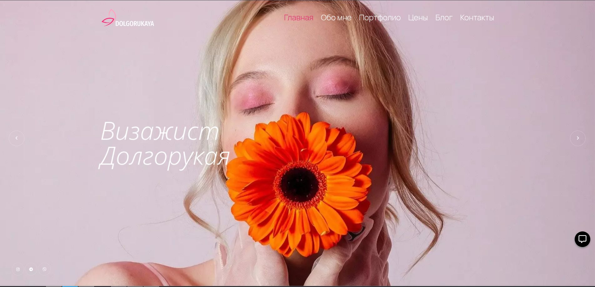
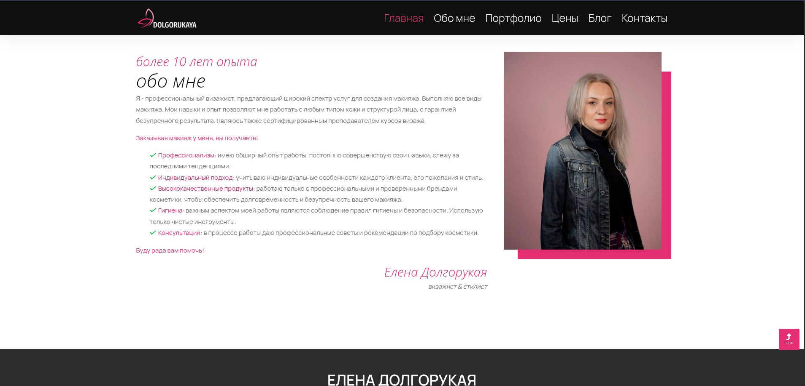
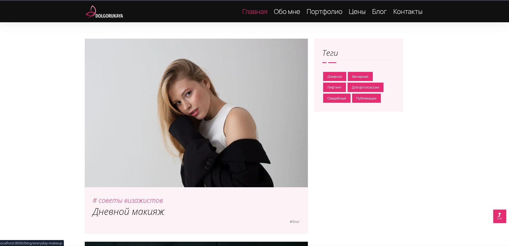
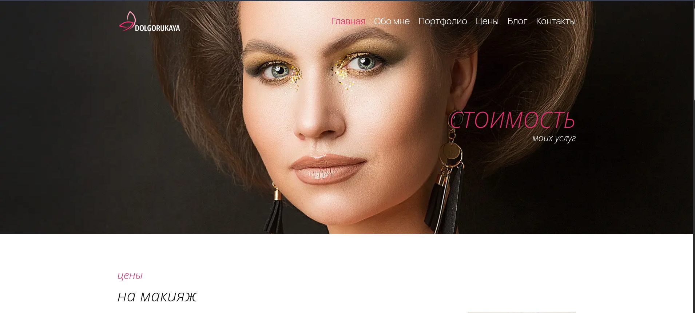
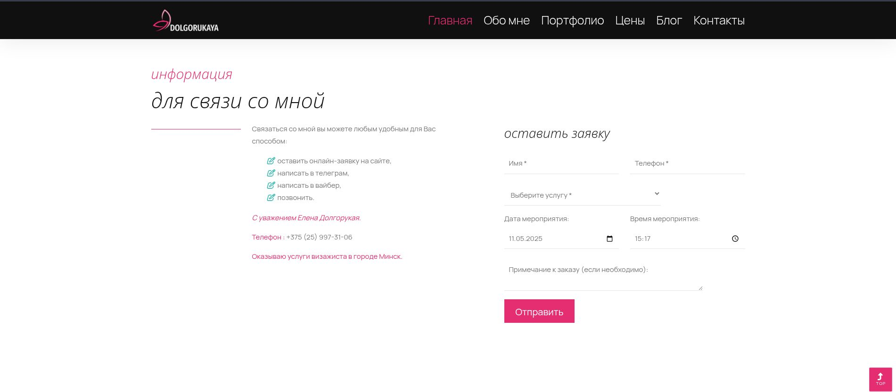
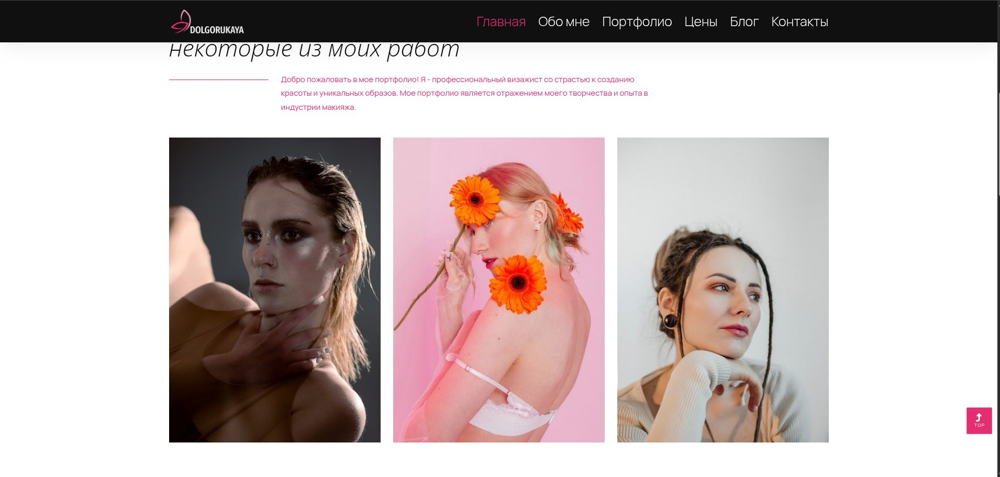
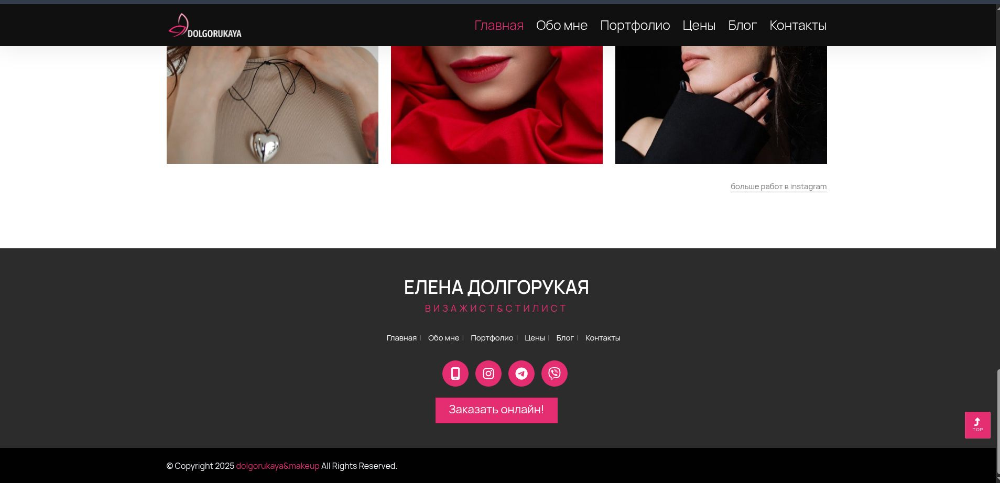
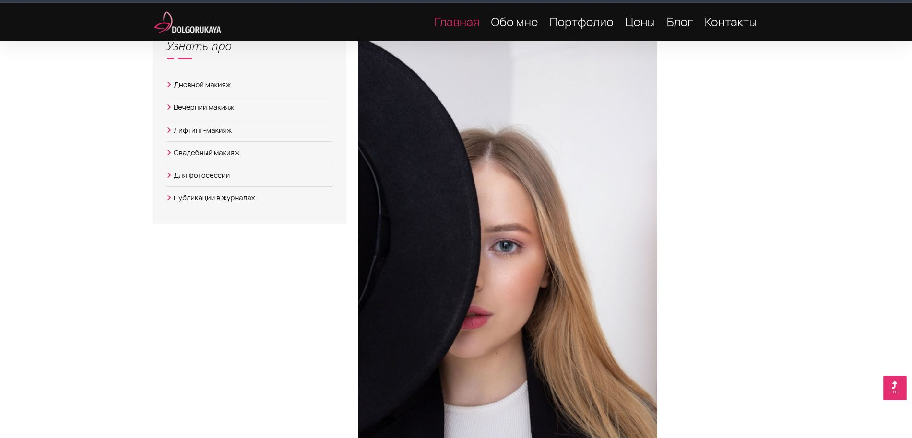
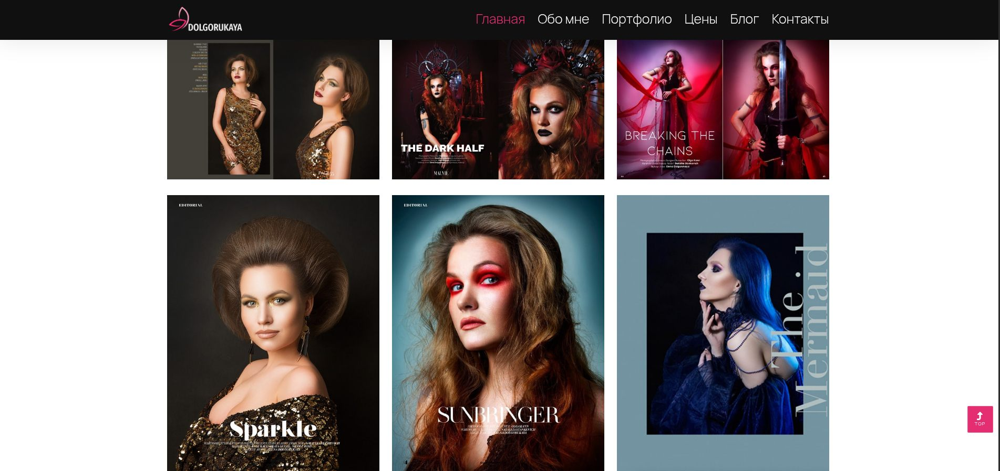

# Makeup artist website

Makeup artist website built using Flask web framework.


#### Core technologies
- Flask
- Docker
- Docker Compose
- Gunicorn
- NGINX

#### Front end
- Bootstrap 5
- JavaScript
- HTML
- CSS


## ScreenShot

<table style=”center“>
    <tr>
        <td style="float:left">
            <a href="https://raw.githubusercontent.com/bizoxe/flask-website/master/ScreenShot/1.jpg">
                
            </a>
        </td>
        <td style="text-align: center;">
            <a href="https://raw.githubusercontent.com/bizoxe/flask-website/master/ScreenShot/2.jpg">
                
            </a>
        </td>
         <td style="text-align: center;">
            <a href="https://raw.githubusercontent.com/bizoxe/flask-website/master/ScreenShot/3.jpg">
                
            </a>
        </td>
    </tr>
    <tr>
        <td style="text-align: center;">
            <a href="https://raw.githubusercontent.com/bizoxe/flask-website/master/ScreenShot/4.jpg">
                
            </a>
        </td>
        <td style="text-align: center;">
            <a href="https://raw.githubusercontent.com/bizoxe/flask-website/master/ScreenShot/5.jpg">
                
            </a>
        </td>
        <td style="text-align: center;">
            <a href="https://raw.githubusercontent.com/bizoxe/flask-website/master/ScreenShot/6.jpg">
                
            </a>
        </td>
    </tr>
    <tr>
        <td style="text-align: center;">
            <a href="https://raw.githubusercontent.com/bizoxe/flask-website/master/ScreenShot/7.jpg">
                
            </a>
        </td>
        <td style="text-align: center;">
            <a href="https://raw.githubusercontent.com/bizoxe/flask-website/master/ScreenShot/8.jpg">
                
            </a>
        </td>
        <td style="text-align: center;">
            <a href="https://raw.githubusercontent.com/bizoxe/flask-website/master/ScreenShot/9.jpg">
                
            </a>
        </td>
    </tr>
</table>


### Note:

The application uses sending emails to the makeup artist with order details using a Gmail account.  
You must create an app password. 
[Link](https://support.reolink.com/hc/en-us/articles/360039461654-How-to-Generate-an-App-Password-in-Gmail-Account/)


Inside the src directory is a .env.template file. Set the values for the environment variables.  
In the same directory (where .env.template is located), create a .env file and copy the contents
of the .env.template file to the .env.


### Clone repository:
```bash
git clone https://github.com/bizoxe/flask-website.git
```
and navigate to cloned project

### Run the application:
```bash
# run this command in the root directory of the project
gunicorn app:app
```

### To run the application using docker:
```bash
# run this command in the root directory of the project
docker compose build
docker compose up -d
```

### Once you launch the app, navigate:
http://localhost:8000/
